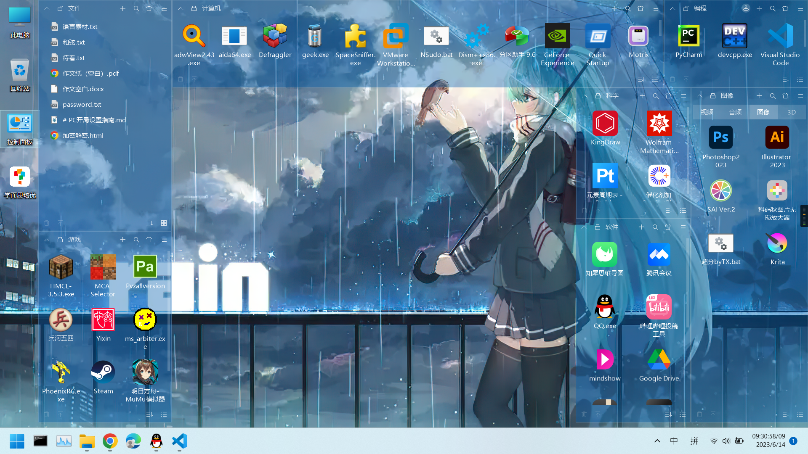
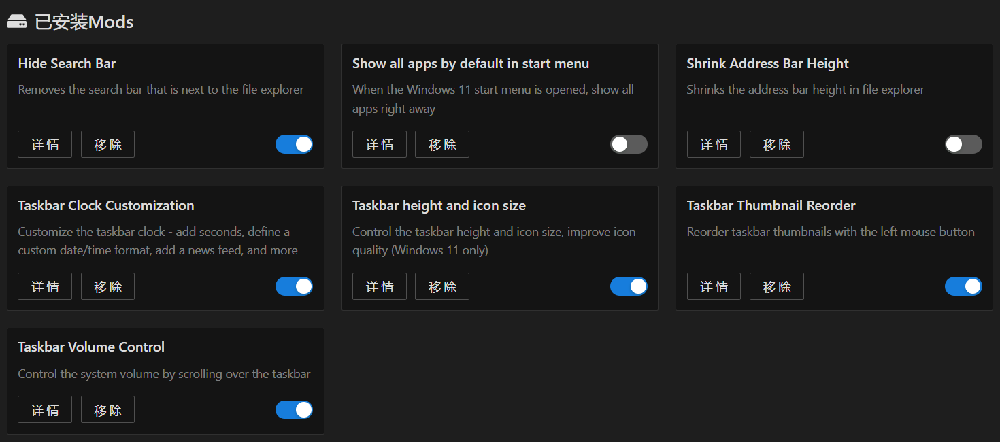

# PC开局设置指南
注：请结合自身PC情况与个人习惯操作
- #### 参考 [电脑应该怎么设置](https://www.bilibili.com/video/BV1CT4y1e7qR) 和 [像操作浏览器那样操作文件资源管理器](https://www.bilibili.com/video/BV15K4y1N7zu)
- #### 使用习惯：不要shift+delete
- #### 系统设置
    - 调出此电脑、回收站、控制面板
    - 将下载等文件夹位置移动至D:\Data\
    - 设置微软输入法 导入“微软拼音数学化学符号自定.dat”
    - 设置电源计划
    - 家庭版安装组策略编辑器
- #### 安装 背景软件
    - Geek Uninstall
    - 7-zip
    - BandiZip
    - Canon 打印机
    - chrome
    - PotPlayer
    - 新版 powershell
    - PowerToys
    - Python & C++
    - QTTabBar
    - SKTimeStamp
    - StartAllBack
    - 火绒
    - 小智桌面
- #### 设置 背景软件
    - chrome 拓展
        - Abcd PDF
        - Adblock Plus
        - AHA Music
        - Btools
        - Global Speed（删除快捷键）
        - Jazz-MIDI
        - Pixiv工具箱
        - Simple Allow Copy
        - WeTab
        - Tampermonkey
            - 喵哉网上冲浪小助手
            - 独轮车-说书人自动弹幕发射器
            - 百度贴吧：不登录即可看贴
            - 知乎增强
            - 秒传链接提取
    - PotPlayer
        - LAV
        - Mad VR
        - 进度条设置：显示时间点、缩略图
    - PowerToys
        - s
    - Path 环境变量
        - Python310\Scripts\
        - Python310\
        - gcc&g++\mingw64\bin
        - ffmpeg\
        - platform-tools\（adb）
        - %UserStartUp% = C:\Users\W\AppData\Roaming\Microsoft\Windows\Start Menu\Programs\Startup
        - %SystemStartUp% = C:\ProgramData\Microsoft\Windows\Start Menu\Programs\StartUp
    - QTTabBar
        - 导入 QTTabBarConfig.xml
        - 快捷栏设置如图
    - StartAllBack 与 火绒 按偏好设置
    - 小智桌面
        - 清理捆绑
        - 布局
        
- #### 安装 计算机 软件夹
    1. NSudo 提权
    2. DISM++
    3. 傲梅分区助手
    4. QuickStartUp 控制自启动
    5. ContextMenuManager 控制右键菜单
    6. clash
    7. HxD 16进制打开文件
    8. C盘清理（自制）
    9. Windhawk
    10. qbittorrent
    11. Cheat Engine
    12. VMware
    13. SpaceSniffer
    14. SpaceSniffer.exe
- #### 安装 编程 软件夹
    1. PyCharm
    2. Git
    3. VS Code
    4. Devcpp
- #### 安装 Adobe 全家桶
    1. PR + ME
    2. AE
    3. AU
    4. PS + AI
- #### 安装 视频 软件夹
    1. Arctime
    2. OBS
    3. BBdown
    4. 音视图万能格式转换
- #### 安装 音频 软件夹
    1. MuseScore 3
    2. Vocaloid 4
    3. Synthesizer V
    4. Melodyne 5
    5. ACE Studio
    6. Ultimate Vocal Remover
    7. 声库
- #### 安装 图像 软件夹
    1. SAI
    2. Krita
    3. 科码秋图片无损放大器 2.0
    4. 超分byTX（自制）
- #### 安装 3D 软件夹
    1. C4D
    2. Blender
    3. MMD
- #### 安装 科学 软件夹
    1. KingDraw
    2. Mathematica
    3. 元素周期表 Ptable（chrome网页应用）
- #### 安装 软件 软件夹
    1. 知犀思维导图
    2. 腾讯会议
    3. QQ
    4. Koodo-Reader
    5. uTools
    6. 哔哩哔哩投稿工具
- #### 安装 游戏 软件夹
    1. Minecraft HMCL
    2. MCA Selector
    3. PVZ allversion
    4. 兵河五四 象棋
    5. Yixin 五子棋
    6. ms_arbiter 扫雷
    7. PhoenixRC 无人机模拟
    8. OSU
    9. MC 地下城
- #### 安装 安卓子系统
    1. 打开 BIOS 虚拟化
    3. 家庭版安装hyper-V
    2. 开启win功能：hyper-V，虚拟机平台
    3. 若安装完打开子系统时报错：未虚拟化或未打开虚拟机平台，则尝试命令
        powershell “bcdedit /set hypervisorlaunchtype auto”
- ### 软件应用设置！！
    - 从这里开始 “[安装 计算机 软件夹](#安装-计算机-软件夹)”
    - CE可能存在捆绑，要清除
    - Windhawk 设置
        
        
        Time format：“hh':'mm':'ss'/'HH”
        Date format：“yyyy/M/d”
        Week day format：“dddd”
- #### 其他设置
    - 封禁 QQ 中的 QQmusic 服务与文件
    - 用 ContextMenuManager 控制右键菜单
    - 用 Protect-Windows-Context-Menu 锁定右键菜单
    - 更改默认打开方式
